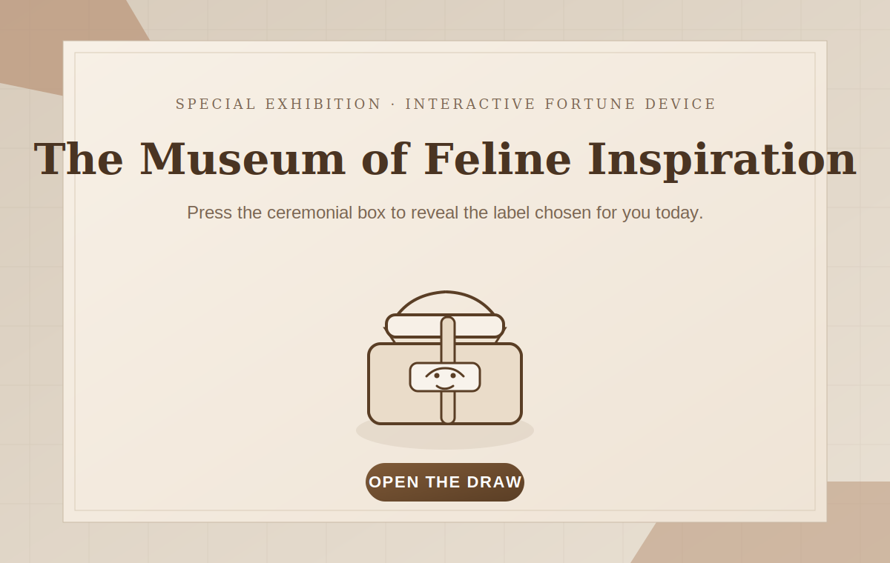

# Feline Inspiration Covenant

A compact museum-style fortune draw page themed around curated cat portraits, rendered in a single static HTML file.

## Live Site

- GitHub Pages: [https://jayuedu.github.io/cat-fortune/](https://jayuedu.github.io/cat-fortune/)
- Repository: [https://github.com/jayuedu/cat-fortune](https://github.com/jayuedu/cat-fortune)

## Preview



## Features

- Single-page museum-inspired fortune draw interface
- Inline SVG fortune box and inline SVG cat portraits
- Randomized cat draw with title, collection, gallery, trait, and blessing text
- Poster-like landing section with a centered visual axis
- No build step required, suitable for direct static hosting

## Project Structure

- `index.html`: page layout, styles, SVG generation logic, and interaction
- `assets/readme-preview.svg`: README preview illustration
- `.gitignore`: ignores local system files such as `.DS_Store`

## Local Development

Open `index.html` directly in a browser, or run a local static server:

```bash
python3 -m http.server 8000
```

Then visit:

- [http://localhost:8000/](http://localhost:8000/)

## Deployment

This project is published with GitHub Pages from the `main` branch root directory.

## License

No license file has been added yet.
